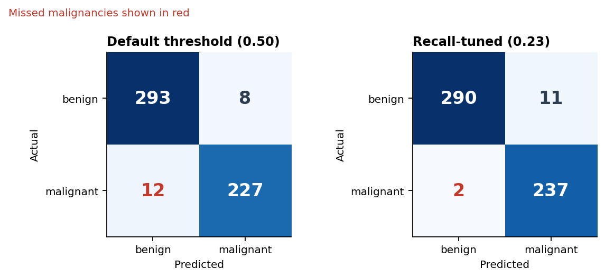
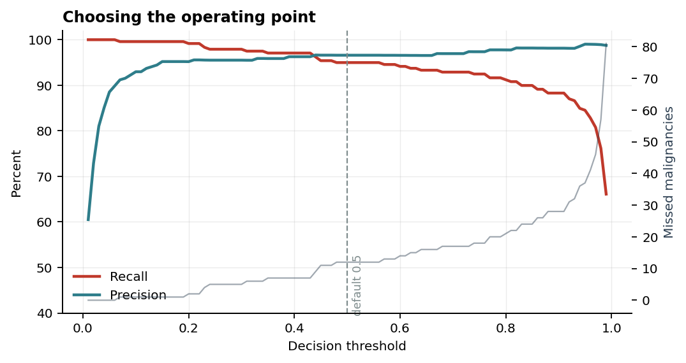
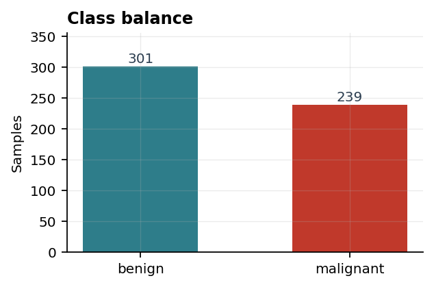
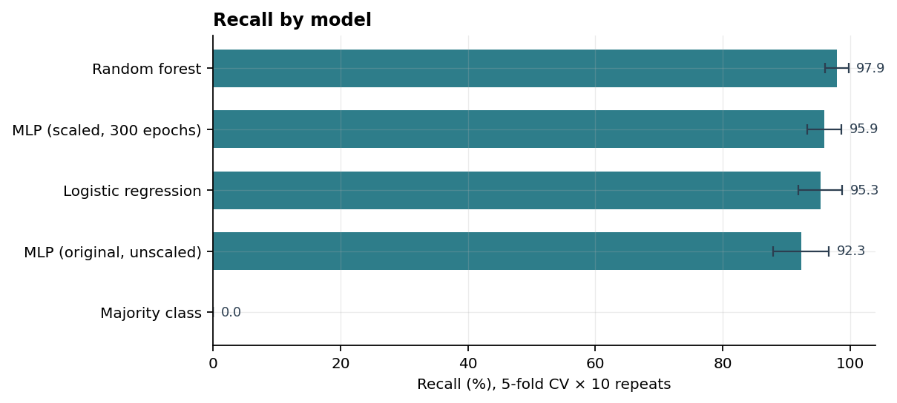
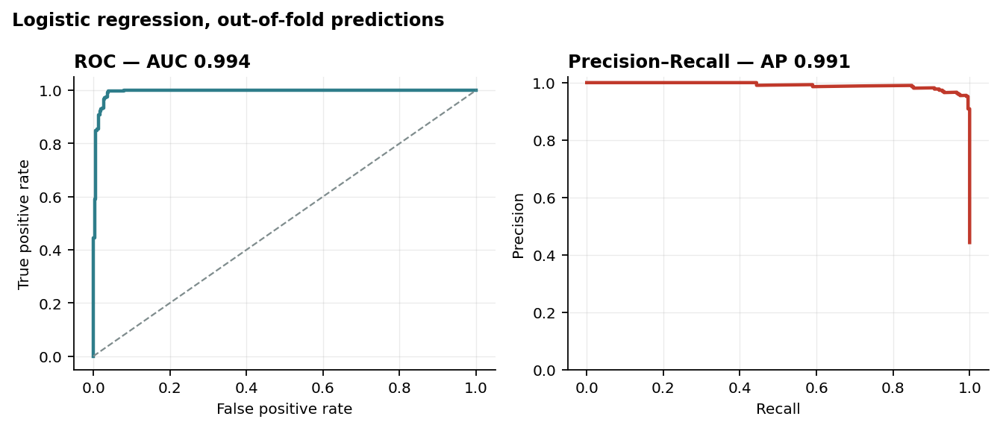
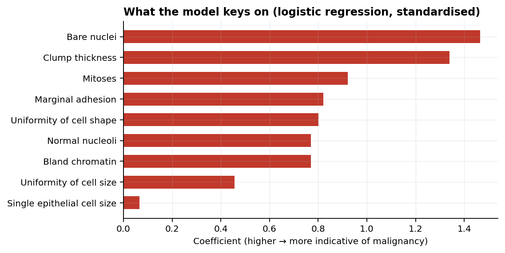

# Breast Cytology Classifier

Classifying breast fine-needle aspirate samples as **benign or malignant**
from nine cytological attributes — and asking a question the original
coursework version didn't: *which mistake are we actually trying to avoid?*

The answer changes the model you ship.

---

## The finding

The obvious metric here is accuracy, and every reasonable model lands around
96–97%. That number hides the thing that matters.

The two errors are not equivalent. A **false positive** sends a healthy
patient for another test. A **false negative** tells someone with a
malignancy they're clear. Accuracy weighs those identically.

So the interesting lever isn't the model — it's the decision threshold:



Moving the cutoff from the default 0.5 down to 0.23 takes missed malignancies
from **12 to 2**, at a cost of **3 additional false alarms**. Same model, same
data, same training. Just a different question asked of the same probabilities.

That single decision matters more than the entire model comparison below.



The 0.5 cutoff is not a clinical choice. It's an arbitrary inheritance from
the sigmoid, and nothing about this problem recommends it.

---

## What the data is (and isn't)

Nine attributes, each scored 1–10 by a pathologist reading a fine-needle
aspirate slide: clump thickness, uniformity of cell size and shape, marginal
adhesion, bare nuclei, bland chromatin, and so on. 540 samples.

**These are measurements from a biopsy that has already happened.** They are
not patient risk factors — not age, family history, or genetics. So this model
supports a diagnosis already underway. It cannot tell a person whether they
are likely to develop cancer, and nothing here should be read as doing that.



Data: [Wisconsin Breast Cancer (Original)](https://archive.ics.uci.edu/dataset/15/breast+cancer+wisconsin+original),
Wolberg & Mangasarian, University of Wisconsin Hospitals, 1991.

---

## Model comparison

Five-fold cross-validation, repeated ten times. Reported as mean ± standard
deviation across all 50 folds.

| model | accuracy | recall | precision | ROC-AUC | missed per fold |
|---|---|---|---|---|---|
| Majority class (baseline) | 55.7% ± 0.4 | 0.0% ± 0.0 | — | 0.500 | 47.8 |
| **Random forest** | **97.2% ± 1.4** | **97.9% ± 1.9** | 95.8% ± 2.5 | 0.992 | **0.98** |
| Logistic regression | 96.4% ± 1.8 | 95.3% ± 3.5 | 96.6% ± 2.6 | 0.995 | 2.24 |
| MLP (scaled, 300 epochs) | 96.4% ± 1.7 | 95.9% ± 2.7 | 96.0% ± 2.6 | 0.994 | 1.94 |
| MLP (original, unscaled) | 94.1% ± 2.4 | 92.3% ± 4.4 | 94.5% ± 3.9 | 0.974 | 3.68 |



Three things worth saying plainly:

**The neural network does not earn its place.** On 540 samples and nine
ordinal features, a logistic regression matches it. The error bars overlap
almost entirely. Reaching for a neural net here adds training time, opacity
and hyperparameters to buy nothing.

**Feature scaling was worth ~2 points.** The original model fed raw 1–10
values straight to the network. Standardising the inputs took it from
94.1% to 96.4% and cut missed cases nearly in half — a bigger gain than any
architecture change.

**The original 96.3% was a favourable split.** That figure came from one
80/20 split with `random_state=42`. Cross-validated, the same model averages
94.1% ± 2.4. The original number wasn't wrong; it just wasn't repeatable, and
with only 108 test cases a single misclassification moves accuracy by a full
point.

---

## The threshold, per model

Tuned so that at least 99% of malignancies are caught, using out-of-fold
predictions across all 239 malignant cases.

| model | missed at 0.50 | tuned threshold | missed | false alarms |
|---|---|---|---|---|
| Logistic regression | 12 | 0.23 | **2** | 11 |
| Random forest | 7 | 0.41 | **2** | 13 |
| MLP (scaled) | 10 | 0.18 | **1** | 12 |

Once the threshold is chosen deliberately, the gap between models nearly
disappears. Logistic regression reaches the same two misses as the random
forest with two fewer false alarms — while staying inspectable, which for a
clinical decision aid is not a small thing.



---

## What the model keys on



Standardised logistic regression coefficients. Bare nuclei and clump
thickness dominate, which matches the cytology literature — bare nuclei in
particular are a long-established malignancy marker. A model whose reasoning
lines up with domain knowledge is easier to trust than one that scores well
for reasons nobody can name.

---

## Running it

```bash
pip install -r requirements.txt
python -m cancer_model.run
```

Regenerates every figure and every number in this README, and writes
[`docs/results.json`](docs/results.json). Nothing here is copied by hand.

```bash
pytest tests/ -q          # 14 tests
```

The tests don't assert the model's accuracy — that's measured, not promised.
They pin the things that could silently corrupt a measurement: validation
that rejects malformed data, folds that keep both classes present, and
threshold selection that actually hits its recall target.

```
src/cancer_model/
  data.py       loading and validation
  models.py     candidates, including the original PyTorch MLP
  evaluate.py   cross-validation, threshold selection
  plots.py      figures
  run.py        the experiment
Model_1.7.ipynb original coursework notebook, kept as submitted
```

---

## Limits

- **540 samples.** Small enough that a single split is unreliable, which is
  why everything here is cross-validated.
- **One source.** All samples come from one hospital in the late 1980s.
  Nothing here says the model generalises to other labs, staining protocols
  or populations.
- **Inputs are already-subjective.** Each feature is a pathologist's 1–10
  judgement. Inter-rater variability is not captured in this dataset and is
  not modelled.
- **Not a medical device.** A coursework project turned into a study of how
  threshold choice interacts with asymmetric error cost. It has not been
  clinically validated and must not be used for diagnosis.

MIT licensed.
